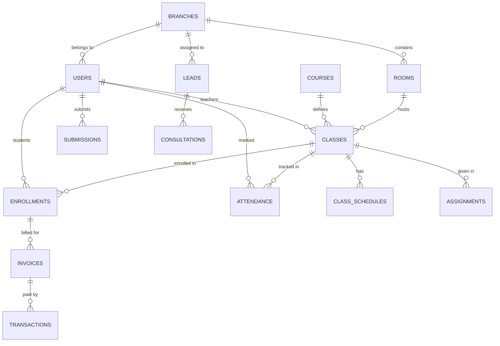

# Database Design Documentation - ELC System

Tài liệu này mô tả chi tiết kiến trúc cơ sở dữ liệu của Hệ thống Quản lý Trung tâm Ngoại ngữ (ELC).

## 1. Sơ đồ Quan hệ Thực thể (ER Diagram)

## 2. Phân hệ Học vụ (SMS)

### Bảng `branches` (Chi nhánh)
Lưu trữ thông tin các cơ sở của trung tâm.
- `id`: UUID (PK)
- `name`: Tên chi nhánh
- `address`: Địa chỉ cơ sở

### Bảng `rooms` (Phòng học)
- `branch_id`: Tham chiếu tới chi nhánh
- `equipment`: Dữ liệu JSON lưu danh sách thiết bị (máy chiếu, điều hòa...)

### Bảng `courses` (Khóa học)
Định nghĩa khung chương trình.
- `level`: Trình độ (Beginner, Intermediate, Advanced)
- `base_price`: Học phí gốc của khóa học

### Bảng `classes` (Lớp học)
Thực thể quan trọng nhất, kết nối giáo viên, phòng và khóa học.
- `current_students`: Tự động cập nhật qua Trigger
- `meeting_url`: Link học trực tuyến (Zoom/Meet)

## 3. Phân hệ Người dùng & Học thuật (LMS)

### Bảng `users` (Người dùng)
Hợp nhất tài khoản đăng nhập và hồ sơ cá nhân.
- `password_hash`: Mật khẩu đã mã hóa (Backend quản lý)
- `role`: MANAGER, TEACHER, STUDENT, ACCOUNTANT, LEAD

### Bảng `attendance` (Điểm danh)
- `UNIQUE(class_id, student_id, session_date)`: Đảm bảo không điểm danh trùng lặp.

### Bảng `assignments` & `submissions`
Hệ thống giao và nộp bài tập về nhà.
- `attachments`: Lưu URL các file tài liệu hỗ trợ.

## 4. Phân hệ Tài chính & CRM

### Bảng `leads` (Khách hàng tiềm năng)
- `status`: NEW, CONTACTED, INTERESTED, ENROLLED, REJECTED
- `branch_id`: Chi nhánh mà lead quan tâm.

### Bảng `promotions` (Khuyến mãi)
- `code`: Mã giảm giá (Vd: ELC2024)
- `usage_count`: Số lần đã sử dụng.

### Bảng `invoices` & `transactions`
Quản lý dòng tiền và gạch nợ tự động.

## 5. Các kiểu dữ liệu Enum tùy chỉnh

| Enum Name | Values |
| --- | --- |
| `user_role` | MANAGER, TEACHER, STUDENT, ACCOUNTANT, LEAD |
| `course_level` | BEGINNER, INTERMEDIATE, ADVANCED |
| `enrollment_status` | PENDING, APPROVED, REJECTED, ACTIVE, COMPLETED, DROPPED |
| `transaction_method` | QR, TRANSFER, CASH, ONLINE |

## 6. Cơ chế Tự động hóa (Triggers)

1.  **`update_updated_at_column`**: Tự động cập nhật thời gian sửa đổi cho tất cả các bảng.
2.  **`update_class_student_count`**: Tối ưu hiệu năng bằng cách cache số lượng học viên trực tiếp vào bảng `classes` thay vì đếm thủ công (COUNT) mỗi lần truy vấn.
