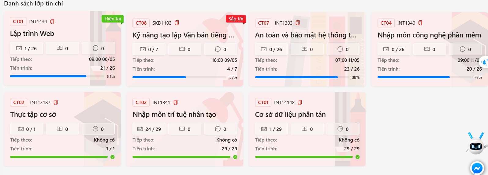

1. Manager thêm buổi học mà có giờ bắt đầu >= giờ kết thúc vẫn thành công
2. Dashboard của Manager nên có thêm những chức năng: Quản lí giáo viên, Quản lí kế toán, Quản lí học viên, Quản lí thông báo, Quản lí chương trình học
3. Tất cả các tab quản lí thì nên có thanh tìm kiếm.
4. lớp nên có 4 trạng thái: mới tạo -> đang tuyển sinh -> đang diễn ra -> hoàn thành. thì khi lớp học xong rồi, hoàn thành khoá học thì sẽ thành completed còn mới tạo thì sẽ là trạng thái vừa tạo ra.
5. Quản lí lớp giao diện chưa tốt, phải là hiển thị các lớp ra, xong rồi ấn vào từng lớp thì xem được chi tiết các buổi học, xong mới có thao tác thêm sửa xoá buổi trong đó. Hiện tại chỉ có xoá lớp. Giao diện này muốn như kiểu slink như này ( Hải tham khảo Slink)

5.1. Manager cũng nên được biết tiến độ của lớp, nếu lớp đang học thì học được bao nhiêu buổi/ bao nhiêu buổi, xem được chi tiết các buổi có học viên nào vắng, nếu lớp đang tuyển sinh/ sắp học thì xem được thông tin, trạng thái lớp đủ học sinh chưa, có bao nhiêu học sinh rồi,..
5.2. Khi manager ấn vào 1 lớp học thì ngoài hiện được các buổi chi tiết, còn có lựa chọn khác là xem được danh sách học viên của lớp đó, khi ấn vào 1 học viên có thể xem được thông tin chi tiết học viên đó.

5.3. Ngày tháng năm thì chuyển về hiển thị đúng dạng như dd/mm/yyyy

6. Hiện đang chưa có tab quản lí giáo viên, quản lí kế toán riêng. Tab quản lí giáo viên này sẽ có danh sách giáo viên, có thể ấn vào xem thông tin chi tiết từng giáo viên, và xem được giáo viên đó đang nhận dạy lớp nào, cũng có thể thêm sửa xoá thông tin giáo viên nếu cần,đối với chức năng xem được giáo viên dạy những lớp nào thì hiện danh sách các lớp giáo viên đó đang dạy, ấn vào 1 lớp thì xem được thông tin như chức năng ấn vào 1 lớp của tab quản lí lớp học. Tương tự với tab quản lí kế toán, có danh sách kế toán, ấn vào kế toán có thể xem được thông tin chi tiết, thêm sửa xoá được. 

7. Có thể có thêm tab quản lí học viên riêng, kiểu hiện danh sách tất cả học viên của trung tâm, và ấn vào 1 học viên thì xem sửa xoá được thông tin học viên, biết được học viên học lớp nào, có thể thực hiện chuyển lớp cho học viên, xem được kết quả học tập của học viên khi giáo viên cập nhật.

8. Phần CRM & Leads chưa ổn, manager nên có tab con xem được các lead nào đang quan tâm đến khoá học của trung tâm, ấn vào 1 lead bất kì có thể hiện thông tin lead và khoá học lead đó quan tâm, xong mới có lựa chọn "Tư vấn" hoặc là "Liên hệ"... tương tự có 1 tab con xem được những lead nào đã ở giai đoạn "Tư vấn" hoặc "Liên hệ" gì đó... ấn vào 1 lead hiện thông tin lead và thông tin khoá học của người đó muốn đăng kí và có lựa chọn "Đã thanh toán học phí", tương tự có danh sách các leads đã đóng tiền học, ấn 1 lead xem được thông tin lead và khoá học và có lựa chọn "Duyệt học viên" để thực hiện duyệt và phân lớp cho học viên. (Role kế toán cũng nên có chức năng xem được tab các lead nào đang quan tâm đến khoá học của trung tâm, ấn vào 1 lead bất kì có thể hiện thông tin lead và khoá học lead đó quan tâm, xong mới có lựa chọn "Tư vấn" hoặc là "Liên hệ"... tương tự có 1 tab con xem được những lead nào đã ở giai đoạn "Tư vấn" hoặc "Liên hệ" gì đó... ấn vào 1 lead hiện thông tin lead và thông tin khoá học của người đó muốn đăng kí và có lựa chọn "Đã thanh toán học phí") 
9. Sau khi leads được thành học viên rồi thì nó sẽ nằm trong tab quản lí student chẳng hạn, không nên tồn tại trong tab leads, sau khi thành học viên thì mọi dữ liệu, thao tác liên quan phải nằm trong tab quản lí học viên

10. Thiếu tab quản lí thông báo: gồm các chức năng tạo thông báo, xem thông báo, có thể lựa chọn tạo thông báo riêng đến các giáo viên, tạo thông báo riêng đến các học viên/ lớp học cụ thể nào đó, và tạo thông báo chung cho toàn trung tâm.

11. Thiếu tab Quản lí chương trình học: Nên có các chức năng tạo mới chương trình, sửa, xoá chương trình,... Có hiện danh sách các chương trình đang có, ấn vào 1 chương trình có thể xem được thông tin chương trình chi tiết và có thể xem được các lớp của chương trình đó, ấn vào 1 lớp thì có thể xem được thông tin chi tiết lớp đó và có các chức năng y như ấn vào 1 lớp trong tab quản lí lớp học 
